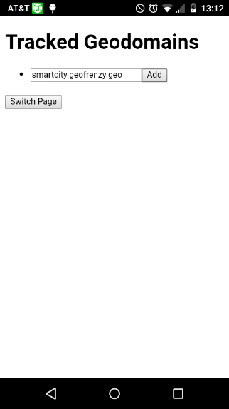

Sample app that demonstrates the functionality of the Fencing Agent for Cordova. 

To try it, just run:
``` bash
cordova build
cordova run
```

The location of the code that uses the Fencing Agent is `www/js/fencing_agent.js`.

The app has two primary screens: A "lightbulb" screen, containing a picture of a [Blink(1) LED](https://blink1.thingm.com/), and a settings menu to select Geodomains.

In this example, the device is inside of a fence belonging to `smartcity.geofrenzy.place`, which has a Requirement specifying a blue color. If the device is in the SmartFences of multiple Geodomains, the lightbulb will cycle between their colors (completing one cycle per second).
If the device is not in any SmartFences, it will have no color, and if it's in a SmartFence whose GeoDomain has no color, it will use white for that GeoDomain.




The button switches between these two screens.
